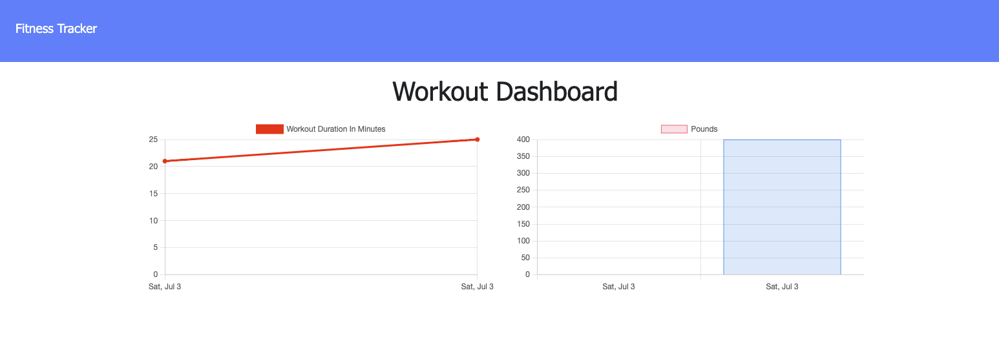

# workout-tracker

Monitor your activity levels using this workout tracker app. 

[Heroku deployment](https://obscure-eyrie-70384.herokuapp.com//)

## Table of Contents
* [Description](#description)
* [Installation](#installation)
* [Screenshot](#screenshot)
* [Contributions](#contributions)

## Description

According to a study conducted in 2020, 63% of people in England aged 16 and over did 150 minutes or more of exercise per week. Physical fitness plays a huge role in overall health, this application aims to encourage more people to get active and reach their exercise goals by providing an easy to use interface to track their workouts.

The backend functionality of the app comes from Node.js, Express, MongoDB and Mongoose. The front end is basic HTML and CSS.

## Installation 

Run npm i to install all dependencies. Create a .env file with you Mongo DB URI.

## Screenshot

## Contributions

Oli Saxon
